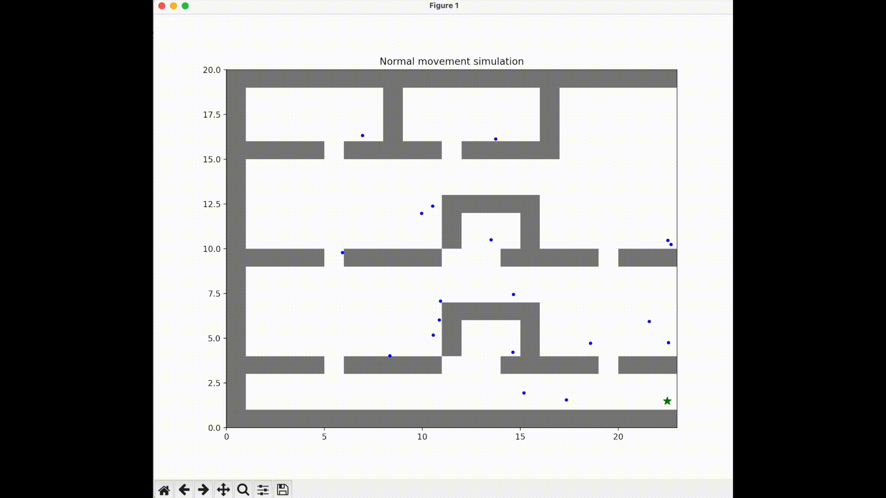
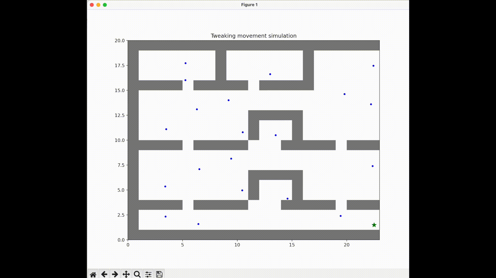
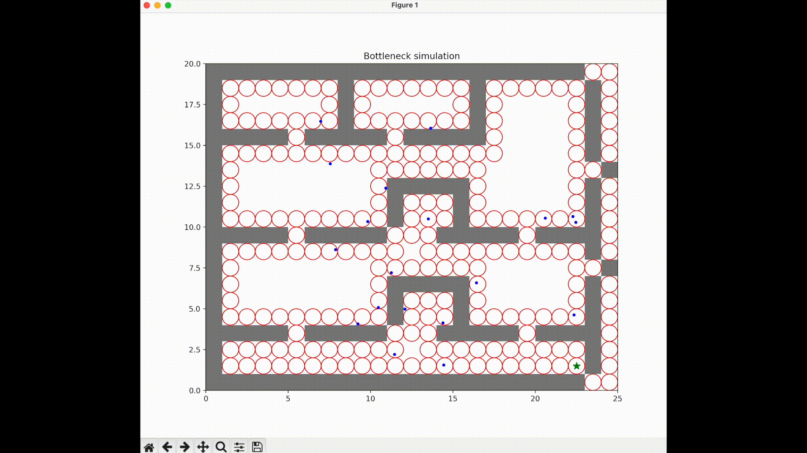
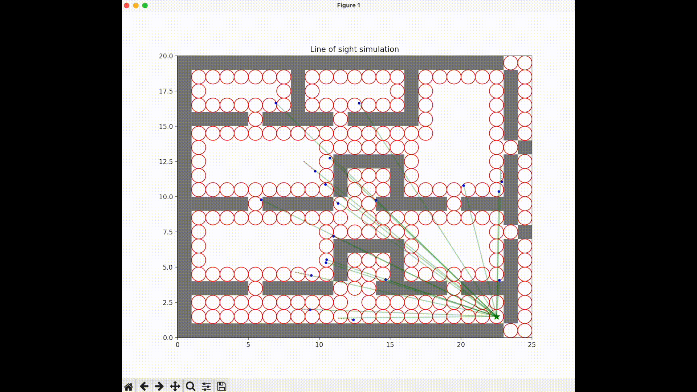
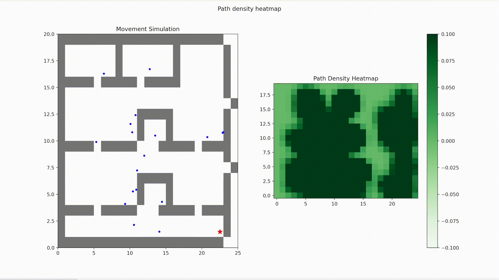
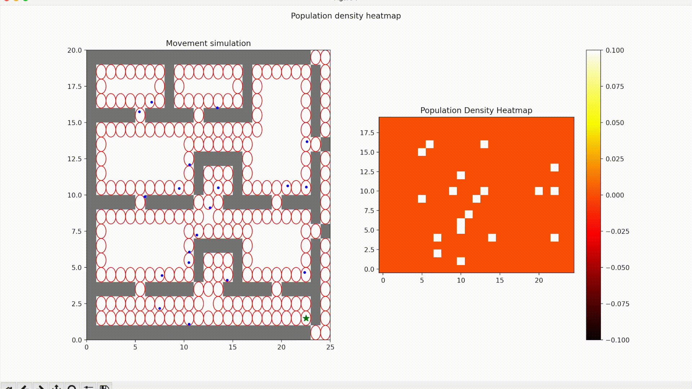
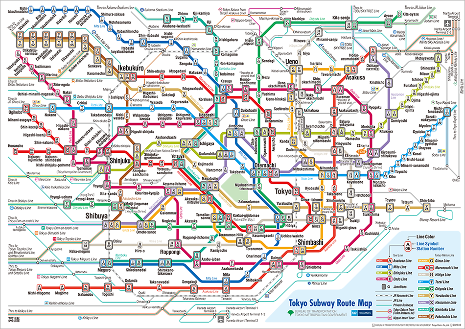

[](https://github.com/gongahkia/chiyoda/releases/tag/1.0.0) 

# `Chiyoda` 🚆

[Simulate](#gifs) [commuter](https://dictionary.cambridge.org/dictionary/english/commuter) dynamics within a [static system](https://www.quora.com/What-is-the-difference-between-a-static-and-dynamic-system).

Implemented in [4 hours and 17 minutes](https://github.com/gongahkia/chiyoda/commit/06ab35a1f475c393faf7a3e2412a90b8e2ef4bb6).

## Usage

```console
$ https://github.com/gongahkia/chiyoda
$ cd chiyoda
$ make config
$ python3 <relevant_file>.py
```

## Layout

| File / Folder name | Purpose |
| :--- | :--- |
| [generate.py](./src/generate.py) | Rule-based generator for sample layouts based on specified heuristics. |
| [normal.py](./src/normal.py) | Simulation of **dynamic bodies**. |
| [tweak.py](./src/tweak.py) | Simulation of **static bodies**. |
| [bottleneck.py](./src/bottleneck.py) | Visualisation of bottlenecks within a space. |
| [los.py](./src/los.py) | Visualisation of line of sights within a space. |
| [path_heatmap.py](./src/path_heatmap.py) | Path density visualisation with a heatmap. |
| [population_heatmap.py](./src/population_heatmap.py) | Population density visualisation with a heatmap. |

## GIFs

1. Normal movement simulation



2. Static simulation



3. Bottleneck simulation



4. Line of sight simulation



5. Path density heatmap simulation



6. Population density heatmap simulation



## Reference

The name `Chiyoda` is in reference to the [Chiyoda Line](https://en.wikipedia.org/wiki/Tokyo_Metro_Chiyoda_Line) of the [Tokyo Metro](https://www.tokyometro.jp/en/index.html), the first line where sarin gas was released *(by [Yasuo Hayashi](https://en.wikipedia.org/wiki/Lin_Tainan) near [Shin-Ochanomizu station](https://en.wikipedia.org/wiki/Shin-ochanomizu_Station) on 20 March 1995, 7:50 am)* as part of the [Tokyo subway sarin attacks](https://en.wikipedia.org/wiki/Tokyo_subway_sarin_attack) enacted by the [Aum Shinrikyo](https://en.wikipedia.org/wiki/Aum_Shinrikyo) cult.



## Research

* [*Boids algorithm demonstration*](https://eater.net/boids) by Ben Eater
* [*Dynamic models of commuter behavior: Experimental investigation and application to the analysis of planned traffic disruptions*](https://www.sciencedirect.com/science/article/abs/pii/0191260790900366) by Hani S. Mahmassani
* [*Cellular Automata and Complexity: Collected Papers*](https://www.stephenwolfram.com/publications/cellular-automata-complexity/) by Stephen Wolfram
* [*Flocking and swarming in a multi-agent dynamical system*](https://pubs.aip.org/aip/cha/article-abstract/33/12/123126/2930567/Flocking-and-swarming-in-a-multi-agent-dynamical?redirectedFrom=fulltext) by Gourab Kumar Sar and Dibakar Ghosh
* [*Exploring Fungal Morphology Simulation and Dynamic Light*](https://dl.acm.org/doi/10.1145/3680530.3695440) by Kexin Wang, Ivy He, Jinke Li, Ali Asadipour and Yitong Sun
* [*Cellular Automata and Applications*](https://www.whitman.edu/Documents/Academics/Mathematics/andrewgw.pdf) by Gavin Andrews
* [*Simulation of a Bio-Inspired Flocking-Based Aggregation Behaviour for Swarm Robotics*](https://www.mdpi.com/2313-7673/9/11/668) by Samira Rasouli, Kerstin Dautenhahn and Chrystopher L. Nehaniv
* [*On complexity of colloid cellular automata*](https://www.nature.com/articles/s41598-024-72107-6) by Andrew Adamatzky, Nic Roberts, Raphael Fortulan, Noushin Raeisi Kheirabadi, Panagiotis Mougkogiannis, Michail-Antisthenis Tsompanas, Genaro J. Martínez, Georgios Ch. Sirakoulis and Alessandro Chiolerio 
* [*Recent trends in robot learning and evolution for swarm robotics*](https://www.frontiersin.org/journals/robotics-and-ai/articles/10.3389/frobt.2023.1134841/full) by Jonas Kuckling
* [*Neural Cellular Automata and Deep Equilibrium Models*](http://arxiv.org/pdf/2501.03573.pdf) by Zhibai Jia
* [*A Cellular Automaton Model for Pedestrians' Movements Influenced by Gaseous Hazardous Material Spreading*](https://onlinelibrary.wiley.com/doi/10.1155/2020/3402198) by J. Makmul
* [*Simulation of Pedestrian Movements Using Fine Grid Cellular Automata*](https://arxiv.org/ftp/arxiv/papers/1406/1406.3567.pdf) by Siamak Sarmadya, Fazilah Harona and Abdullah Zawawi Taliba
* [*Using Cellular Automata to Model High Density Pedestrian Dynamics*](https://pmc.ncbi.nlm.nih.gov/articles/PMC7302238/) by Grzegorz Bazior, Dariusz Pałka and Jarosław Wąs
