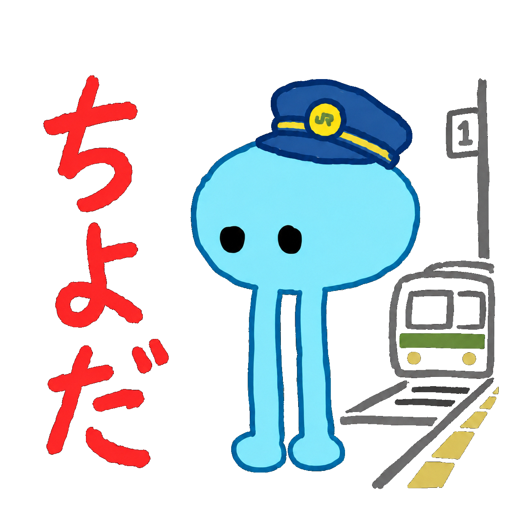
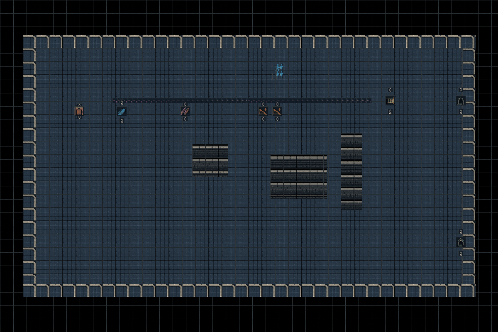
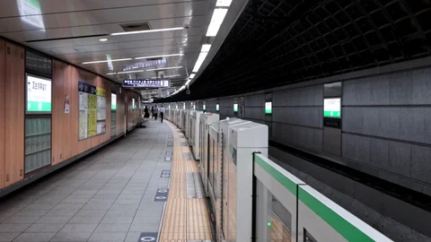

<h1 align="center"><code>Chiyoda</code></h1>

<p align="center"></p>

<p align="center"><em>A Domain-specific Language for simulating Pedestrian-flow</em></p>

<p align="center">
  <a href="https://github.com/gongahkia/chiyoda/releases/tag/1.0.0"></a>
  <a href="https://github.com/gongahkia/chiyoda/actions/workflows/verify.yml/"></a>
</p>

## What is Chiyoda?

`Chiyoda` is a [deterministic](#features) 2D/3D [pedestrian-flow](https://www.researchgate.net/figure/Examples-of-pedestrian-flow-data_tbl1_366989142) simulator built atop a typed [DSL](https://en.wikipedia.org/wiki/Domain-specific_language) for [scenario source specification](#the-chiyoda-dsl).

## Features

* **Text-first**: Author geometry, demand, routes, capacities, and state changes in a small DSL with explicit SI units
* **Deterministic**: Run the same valid scenario with the same runtime and get the same result
* **Inspectable**: Format, validate, compile, run, and replay from the command line
* **Reproducible**: Runs include their source and a hash-verifiable `run.json` bundle

## GIFs



## The `Chiyoda` DSL

Below is a simple example of the statically checked DSL in action. See [`docs/language.md`](./docs/language.md) for a more detailed language specificaton.

`Chiyoda` files end with the `.chy` file extension.

```chy
scenario "concourse-transfer"
seed 73
duration 120s
timestep 100ms

surface platform at (0m, 0m, 6m) size (40m, 16m)
surface concourse at (0m, 0m, 0m) size (40m, 16m)
obstacle retail_kiosk on concourse at (18m, 6m, 0m) size (4m, 4m)
waypoint fare_hall on concourse at (28m, 8m, 0m) dwell 5s
exit street on concourse at (40m, 8m, 0m) width 3m capacity 3/s
stair north_stair from platform at (24m, 8m, 6m) to concourse at (24m, 8m, 0m) width 2m capacity 1.5/s clearance 2.1m
gate fare_gate on concourse at (32m, 8m, 0m) width 2m capacity 18/s to street
agents passengers count 120 on platform at (8m, 8m, 6m) to street speed 1.2m/s radius 0.3m height 1.7m via fare_hall release 0s
```

## Usage

> [!NOTE]  
> `Chiyoda` uses [Rust 1.98.0](https://releases.rs/docs/1.98.0/) through `rust-toolchain.toml`.

The below instructions are for running `Chiyoda` locally.

1. First clone `Chiyoda` to your machine.

```console
$ git clone https://github.com/gongahkia/chiyoda.git && cd chiyoda
```

2. Next execute the below to build `Chiyoda`'s scenario CLI and its native replay viewer *(currently only supported on Linux Display Servers)*.

```console
$ cargo build --release --workspace --locked
$ export PATH="$PWD/target/release:$PATH"
```

3. Finally, run any of below commands to use `Chiyoda`'s functionality.

```console
$ chiyoda generate --seed 73 -o example.chy
$ chiyoda format example.chy -o example.formatted.chy
$ chiyoda check example.formatted.chy
$ chiyoda compile example.formatted.chy -o out/example.ir.json
$ chiyoda run example.formatted.chy -o out/example
$ chiyoda replay out/example/run.json
```

## Reference

The name `Chiyoda` is in reference to the [Tokyo Metro Chiyoda Line](https://en.wikipedia.org/wiki/Tokyo_Metro_Chiyoda_Line) and the [1995 Tokyo Subway Sarin Attack](https://en.wikipedia.org/wiki/Tokyo_subway_sarin_attack) enacted by the [Aum Shinrikyo](https://en.wikipedia.org/wiki/Aum_Shinrikyo) Cult.

<div align="center">
    
</div>
