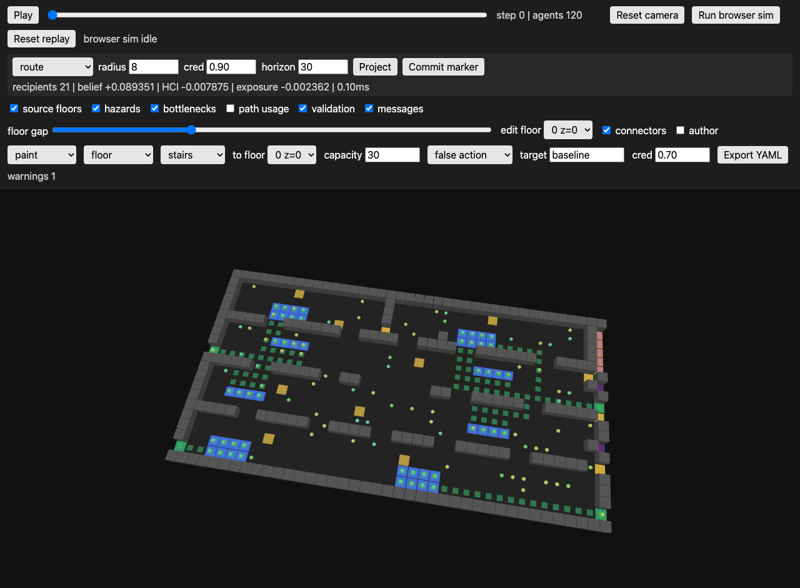

# Dispatcher Demo

Chiyoda's static viewer now has a dispatcher panel for paused-run message
projections. The operator can choose a message type, radius, credibility, and
horizon, then project belief, harmful-convergence, and exposure deltas before
committing a marker.

Workflow:

1. Open a viewer export.
2. Pause playback or leave it at the current frame.
3. Select `dispatch` in the author tool and click a target cell, or use the
   default active-floor center.
4. Set message type, radius, credibility, and horizon.
5. Click `Project`.
6. Review `recipients`, `belief`, `HCI`, `exposure`, and runtime.
7. Click `Commit marker` only after the projected deltas look acceptable.

The screenshot run used `scenarios/station_baseline.yaml` at step 0. The
browser projection reported 21 recipients, belief `+0.089351`, HCI `-0.007875`,
exposure `-0.002362`, and `0.10ms` runtime. The Python regression test checks
the same projection primitive stays under 500ms on the station baseline.

References:

- InControl digital twin simulation software: <https://www.incontrolsim.com/>
- [Unverified] AnyLogic metro digital-twin case URL from `TODO.md` was blocked
  by Cloudflare from this environment, so this demo does not make claims from
  its page content:
  <https://www.anylogic.com/resources/case-studies/planning-crowd-management-in-a-metropolis-with-a-simulation-based-digital-twin/>
